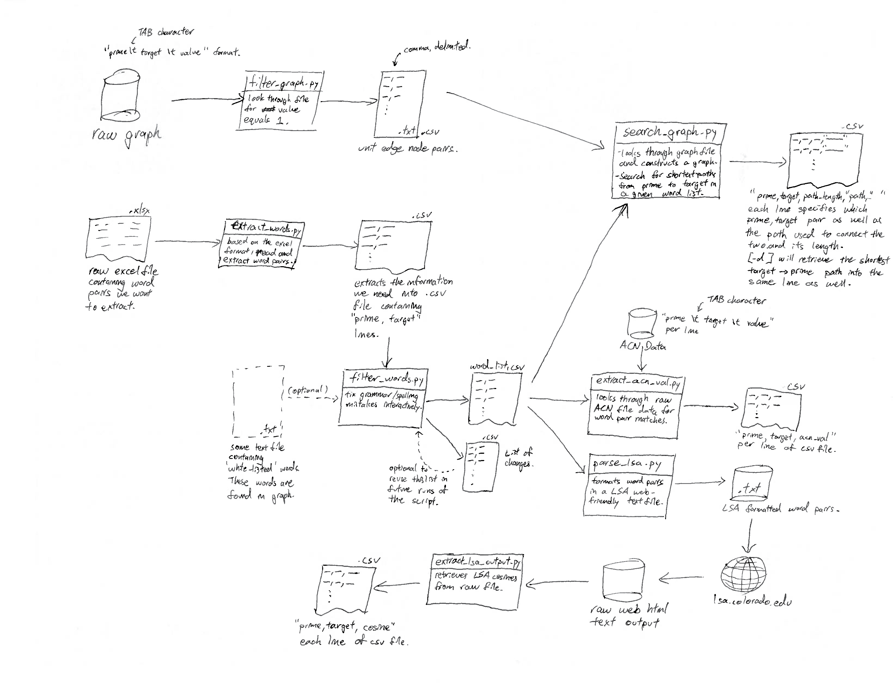

# Python Toolkit

## Overview

**GOAL:**
1) We want to extract the shortest paths between word pairs specified in a given file.

2) Extract certain other pertinent information matching given list of word pairs from other sources (ACN/LSA/word2vec cosines).

**Pre-processing:**
1) Filter large raw graph data files to just a list of unit-length edge node pairs.

2) Extract a list of word pairs from raw excel file and correct for grammar and spelling mistakes.

**Main Steps:**
1) `search_graph.py` Loads graph ([-d] optional flag for directed graphs) outputs shortest paths into .csv file.

2) `extract_acn_val.py` Scans through ACN raw data file for values matching word pairs and records them into .csv file.

3) `parse_lsa.py` -> WEB -> `extract_lsa_output.py` Formats our word pairs list into lsa.colorado.edu format and extracts LSA cosines from web query output.

## Data Pipeline Diagram


*running any .py script without supplying arguments will print a helpful usage message specifying what arguments needs to be supplied.* **Example:** `Usage: python .\search_graph.py <word_list> <.graph file> <output file name> [ -d ]`

*see bottom for sample command line execution*

### Generating Graphs

Use `filter_graph.py` and supply with some raw data file in `prime \t target \t path_length` format to extract all unit-length edge node pairs. Uses minimal memory and scans 600MB raw data file in 35s. Generates `.graph` file (this file extension needs to be specified).

### Pre-processing: Generating word list

Use `extract_words.py` then `filter_words.py` to fix grammar/spelling mistakes and supply required arguments to generate list of \<prime, target\> pair queries from .csv file.

We should have a `.csv` file with `prime,target` on each line, let's call this `word_pairs.csv`.

### Searching for shortest paths in Graph

Use `search_graph.py` and supply `word_pairs.csv` and `.graph` file to generate paths for each word pair. Graph is loaded into memory and a bfs is run with memoization to search for paths.

### Extracting other values

Use `extract_acn_val.py` to extract acn values for pairs in `word_pairs.csv` from raw ACN graph data file.

Use `parse_lsa.py` to transform `word_pairs.csv` file to lsa web format (newline separated pairs).

Use `extract_lsa_output.py` to extract cosines from web output.

## Sample search script output
```
PS > python .\search_graph.py .\word_pairs_filtered.txt .\graph\pat
hlengths_undirected_step_distance_pmfg.graph .\paths\pathlengths_undirected_step_distance_pmfg.csv
Loading word list... [2.0ms]
Loading graph from file: .\graph\pathlengths_undirected_step_distance_pmfg.graph
Graph Loaded... [53.012ms]
Paths found... [23980.844ms]
```

## Sample execution order
```
#Pipeline starting from word_pairs_single.csv (raw copy of first 2 columns of MOESM3_ESM excel file)

#Extract words from raw excel file into <prime, target> .csv file
python extract_words.py word_pairs_single.csv -s

#Fix words in <prime, target> formatted .csv
python filter_words.py word_pairs_single_filtered.csv -words graph_words.csv

#Parse .csv to lsa required format .txt
python parse_lsa.py word_pairs_single_filtered_fixed.csv

#Extract cosines from lsa web output
python extract_lsa_output.py word_pairs_single_filtered_fixed_lsa_raw.txt

#Generate ACN values given list of <prime, target>
python extract_acn_val.py word_pairs_single_filtered_fixed.csv data\acn_correlation_matrix.data

#Run searches through graphs
python search_graph.py word_pairs_single_filtered_fixed.csv graph\pathlengths_directed_step_distance.graph results\word_pairs_single_filtered_fixed_directed_step_distance.csv -d
python search_graph.py word_pairs_single_filtered_fixed.csv graph\pathlengths_undirected_kennetetal.graph results\word_pairs_single_filtered_fixed_undirected_kennetetal.csv
python search_graph.py word_pairs_single_filtered_fixed.csv graph\pathlengths_undirected_step_distance.graph results\word_pairs_single_filtered_fixed_undirected_step_distance.csv
python search_graph.py word_pairs_single_filtered_fixed.csv graph\pathlengths_undirected_step_distance_pmfg.graph results\word_pairs_single_filtered_fixed_undirected_step_distance_pmfg.csv
```
