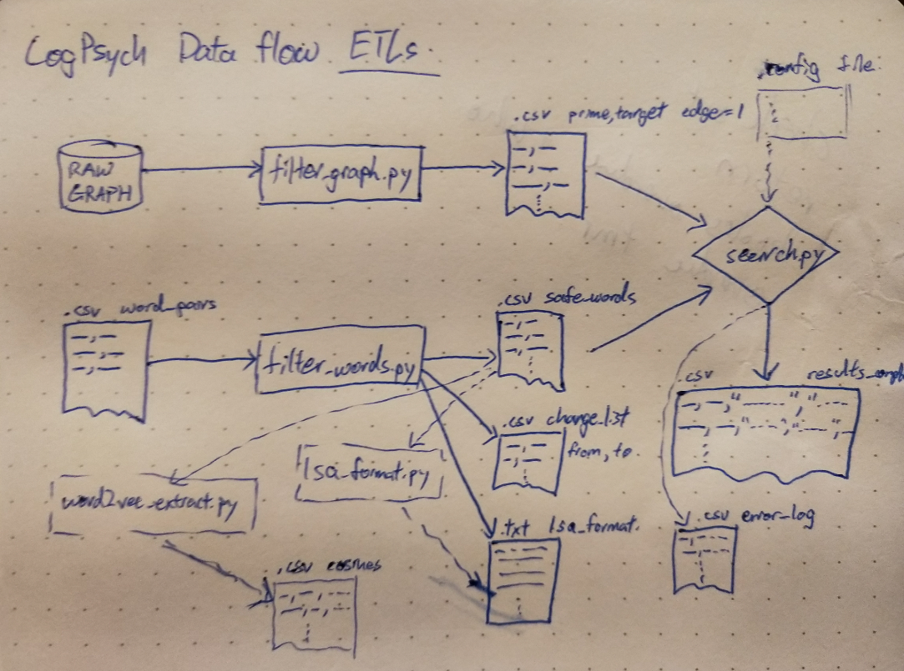

# Python Toolkit

## Scripts

- extract_words.py

- extract_acn_val.py

- extract_lsa_output.py

- filter_graph.py

- filter_words.py

- parse_lsa.py

- search_graph.py

## Data Pipeline Diagram
`In-Progress`


## Filtering Word-Pairs

Use `extract_words.py` then `filter_words.py` to fix grammar/spelling mistakes and supply required arguments to generate list of \<prime, target\> pair queries from .csv file.

Use `parse_lsa.py` to transform .csv file to lsa web format (newline separated pairs).

Use `extract_lsa_output.py` to extract cosines from web output.

Use `extract_acn_val.py` to extract acn values from raw ACN graph data file.

## Generating Graphs

Use `filter_graph.py` and supply with some raw data file in `prime \t target \t path_length` format to extract all neighboring node pairs. Uses minimal memory and scans 600MB raw data file in 35s.

## Searching for paths

Use `search_graph.py` and supply filtered word list and .graph file to generate paths for each word pair. Graph is loaded into memory and a bfs is run with memoization to search for paths.

#### Search Script Outputs
```
PS > python .\search_graph.py .\word_pairs_filtered.txt .\graph\pat
hlengths_directed_step_distance.graph .\paths\pathlengths_directed_step_distance.csv -d
Loading word list... [3.001ms]
Loading graph from file: .\graph\pathlengths_directed_step_distance.graph
Graph Loaded... [93.029ms]
Paths found... [18380.337ms]

PS > python .\search_graph.py .\word_pairs_filtered.txt .\graph\pat
hlengths_undirected_kennetetal.graph .\paths\pathlengths_undirected_kennetetal.csv
Loading word list... [3.0ms]
Loading graph from file: .\graph\pathlengths_undirected_kennetetal.graph
Graph Loaded... [52.012ms]
Paths found... [23884.555ms]

PS > python .\search_graph.py .\word_pairs_filtered.txt .\graph\pat
hlengths_undirected_step_distance.graph .\paths\pathlengths_undirected_step_distance.csv
Loading word list... [2.028ms]
Loading graph from file: .\graph\pathlengths_undirected_step_distance.graph
Graph Loaded... [177.338ms]
Paths found... [16875.377ms]

PS > python .\search_graph.py .\word_pairs_filtered.txt .\graph\pat
hlengths_undirected_step_distance_pmfg.graph .\paths\pathlengths_undirected_step_distance_pmfg.csv
Loading word list... [2.0ms]
Loading graph from file: .\graph\pathlengths_undirected_step_distance_pmfg.graph
Graph Loaded... [53.012ms]
Paths found... [23980.844ms]
```

## Sample Execution Order
```
#Pipeline starting from word_pairs_single.csv (raw copy of first 2 columns of MOESM3_ESM excel file)

#Extract words from raw excel file into <prime, target> .csv file
python extract_words.py word_pairs_single.csv -s

#Fix words in <prime, target> formatted .csv
python filter_words.py word_pairs_single_filtered.csv -words graph_words.csv

#Parse .csv to lsa required format .txt
python parse_lsa.py word_pairs_single_filtered_fixed.csv

#Extract cosines from lsa web output
python extract_lsa_output.py word_pairs_single_filtered_fixed_lsa_raw.txt

#Generate ACN values given list of <prime, target>
python extract_acn_val.py word_pairs_single_filtered_fixed.csv data\acn_correlation_matrix.data

#Run searches through graphs
python search_graph.py word_pairs_single_filtered_fixed.csv graph\pathlengths_directed_step_distance.graph results\word_pairs_single_filtered_fixed_directed_step_distance.csv -d
python search_graph.py word_pairs_single_filtered_fixed.csv graph\pathlengths_undirected_kennetetal.graph results\word_pairs_single_filtered_fixed_undirected_kennetetal.csv
python search_graph.py word_pairs_single_filtered_fixed.csv graph\pathlengths_undirected_step_distance.graph results\word_pairs_single_filtered_fixed_undirected_step_distance.csv
python search_graph.py word_pairs_single_filtered_fixed.csv graph\pathlengths_undirected_step_distance_pmfg.graph results\word_pairs_single_filtered_fixed_undirected_step_distance_pmfg.csv
```
